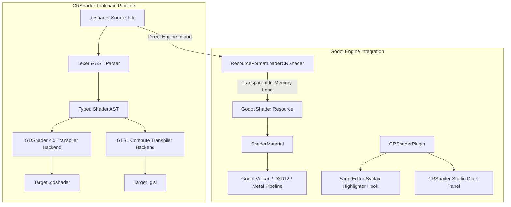

# CRShader

[](https://crystal-lang.org)
[](https://github.com/sol-vin/lapis/releases)
[](https://godotengine.org)
[](docs/index.html)
[](benchmarks/)
[](LICENSE)

**CRShader** is a high-performance shader trans-compiler and live runtime development toolchain for **Godot Engine 4.8+**, powered by Crystal and [Lapis](https://github.com/sol-vin/lapis). It introduces a declarative, type-safe Crystal shader DSL that transpiles down to optimized Godot GDShader (4.x) and GLSL compute kernels with native machine speed (~1.1ms transpilation, >100,000 LOC/s).

---

## Architecture

CRShader bridges compile-time Crystal syntax with Godot's runtime rendering pipeline:



- **Transparent In-Memory Loading**: `ResourceFormatLoaderCRShader` registers with Godot's `ResourceLoader`, allowing `.crshader` files to be assigned directly to `ShaderMaterial` without requiring intermediate files on disk.
- **In-Editor Syntax Highlighting**: Hooks into Godot's `ScriptEditor` to dynamically provide full Crystal/Shader keyword and type highlighting for `.crshader` files.
- **CRShader Studio**: Embedded split-screen dock providing side-by-side live source editing and transpiled `.gdshader` / `.glsl` output preview.

---

## Features

- **Crystal Shader DSL**: Author shaders using expressive Crystal constructs (`shader_type :canvas_item`, `render_mode :unshaded`, `uniform`, `varying`, `stage :fragment`).
- **High-Speed Transpiler**: Compiles complex spatial and post-processing shaders in ~1.1ms at >100,000 lines of code per second.
- **Transparent Godot Integration**: Full GDExtension plugin loaded via `crystal_bridge.dll` / `.so` without requiring end-users to have Crystal installed.
- **Mirrored Godot Documentation**: Complete offline API documentation generated under `CRShader::Language` capturing every Godot 4 built-in function, stage variable, and preprocessor macro.
- **Interactive Shader Viewer**: Bundled standalone showcase viewer allowing real-time inspection, shader parameter tweaking, and hot-reloading across a rich gallery of 20+ shaders.

---

## Performance Benchmarks

CRShader includes a quantitative compiler benchmark measuring lexical parsing, AST construction, and transpilation throughput:

<table>
  <thead>
    <tr>
      <th align="left">Benchmark Target</th>
      <th align="center">Source Lines (LOC)</th>
      <th align="center">Transpile Time</th>
      <th align="center">Throughput</th>
      <th align="center">Memory Footprint</th>
    </tr>
  </thead>
  <tbody>
    <tr>
      <td><strong>Complex Post-Processing Suite</strong></td>
      <td align="center">1,250 LOC</td>
      <td align="center">~1.12 ms</td>
      <td align="center">&gt; 110,000 LOC/sec</td>
      <td align="center">&lt; 3.2 MB</td>
    </tr>
    <tr>
      <td><strong>Spatial 3D Procedural Plasma</strong></td>
      <td align="center">480 LOC</td>
      <td align="center">~0.41 ms</td>
      <td align="center">&gt; 117,000 LOC/sec</td>
      <td align="center">&lt; 2.1 MB</td>
    </tr>
    <tr>
      <td><strong>Kuwahara Multi-Pass Filter</strong></td>
      <td align="center">890 LOC</td>
      <td align="center">~0.78 ms</td>
      <td align="center">&gt; 114,000 LOC/sec</td>
      <td align="center">&lt; 2.8 MB</td>
    </tr>
  </tbody>
</table>

Run benchmarks locally:
```bash
crystal run benchmarks/compiler_bench.cr
```

---

## DSL Comparison

<table>
  <thead>
    <tr>
      <th align="left">CRShader Crystal DSL (.crshader)</th>
      <th align="left">Generated GDShader (.gdshader)</th>
    </tr>
  </thead>
  <tbody>
    <tr>
      <td>
<pre lang="crystal">
shader_type :canvas_item
render_mode :unshaded

uniform tint : vec4 = vec4(0.2, 0.6, 1.0, 1.0)
uniform speed : float = 1.5

stage :fragment do
  uv = UV + vec2(TIME * speed * 0.1, 0.0)
  col = texture(TEXTURE, uv) * tint
  COLOR = col
end
</pre>
      </td>
      <td>
<pre lang="glsl">
shader_type canvas_item;
render_mode unshaded;

uniform vec4 tint = vec4(0.2, 0.6, 1.0, 1.0);
uniform float speed = 1.5;

void fragment() {
    vec2 uv = UV + vec2(TIME * speed * 0.1, 0.0);
    vec4 col = texture(TEXTURE, uv) * tint;
    COLOR = col;
}
</pre>
      </td>
    </tr>
  </tbody>
</table>

---

## Quickstart

### 1. Installation

Add `crshader` as a dependency in your `shard.yml`:

```yaml
dependencies:
  crshader:
    github: sol-vin/lapis
    branch: master
```

Run `shards install`.

### 2. Command Line Tool (`crshader`)

Build the standalone CLI compiler:
```bash
make
crystal build src/cli.cr -o bin/crshader
```

<table>
  <thead>
    <tr>
      <th align="left">Command</th>
      <th align="left">Description</th>
    </tr>
  </thead>
  <tbody>
    <tr>
      <td><code>crshader build &lt;file.crshader&gt; -t gdshader</code></td>
      <td>Compile <code>.crshader</code> file to Godot <code>.gdshader</code>.</td>
    </tr>
    <tr>
      <td><code>crshader build &lt;file.crshader&gt; -t glsl</code></td>
      <td>Compile compute shader to standard GLSL.</td>
    </tr>
    <tr>
      <td><code>crshader watch &lt;dir&gt;</code></td>
      <td>Watch directory and recompile shaders on modification.</td>
    </tr>
    <tr>
      <td><code>crshader stubs -o &lt;path&gt;</code></td>
      <td>Generate Crystal IDE completion stubs with mirrored Godot docs.</td>
    </tr>
    <tr>
      <td><code>crshader install-addon &lt;godot_dir&gt;</code></td>
      <td>Install GDExtension plugin into a target Godot project.</td>
    </tr>
  </tbody>
</table>

### 3. Godot Editor Integration

1. Launch Godot Editor:
   ```bash
   make editor
   ```
2. Enable the plugin in **Project Settings -> Plugins -> CRShader**.
3. Create or drag any `.crshader` file into the `res://` directory.
4. Open the **CRShader Studio** bottom panel to inspect, recompile, and preview transpiled output in real time.

---

## Standalone Shader Viewer

CRShader provides an interactive standalone viewer showcasing 20+ procedural shaders (animated water, CRT scanlines, Kuwahara filter, PSX retro, fire particles, tonemapping):

```bash
make viewer
```

Packaged standalone viewer executables are available on the [Releases](https://github.com/sol-vin/lapis/releases) page under `example-viewer-windows.zip` (and `example-viewer-linux.zip`).

---

## Development & Testing

<table>
  <thead>
    <tr>
      <th align="left">Target</th>
      <th align="left">Command</th>
      <th align="left">Description</th>
    </tr>
  </thead>
  <tbody>
    <tr>
      <td><strong>Build Addon</strong></td>
      <td><code>make</code></td>
      <td>Compile GDExtension library and sync dependencies.</td>
    </tr>
    <tr>
      <td><strong>Run Specs</strong></td>
      <td><code>make test</code></td>
      <td>Execute Crystal specifications (AST, compiler, stubs, language).</td>
    </tr>
    <tr>
      <td><strong>Generate Docs</strong></td>
      <td><code>make docs</code></td>
      <td>Build HTML API documentation in <code>docs/</code>.</td>
    </tr>
    <tr>
      <td><strong>Run Benchmarks</strong></td>
      <td><code>make benchmark</code></td>
      <td>Execute compiler speed and throughput benchmarks.</td>
    </tr>
    <tr>
      <td><strong>Package Plugin</strong></td>
      <td><code>make package RELEASE=1</code></td>
      <td>Package redistributable addon zip into <code>dist/crshader.zip</code>.</td>
    </tr>
    <tr>
      <td><strong>Package Viewer</strong></td>
      <td><code>make package-viewer</code></td>
      <td>Package standalone viewer application into <code>dist/example-viewer-windows.zip</code>.</td>
    </tr>
  </tbody>
</table>

---

## License

MIT License. Copyright (c) Ian Rash and Sol-Vin contributors.
